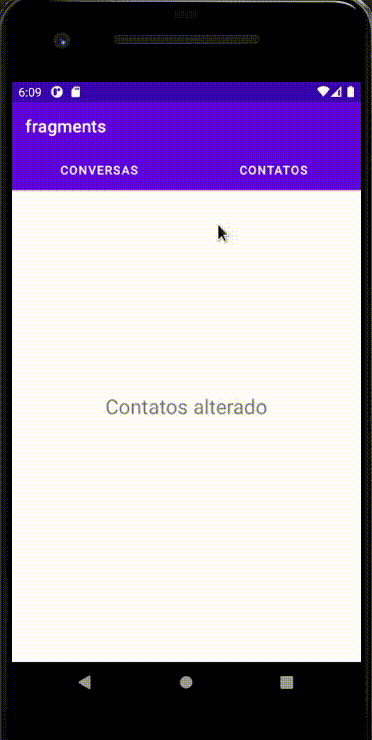

<h1 align="center">
 
  
 
 
Fragments
</h1>

Description

A Fragment represents a reusable part of your app's UI. A fragment defines and manages the layout itself, has its own life cycle and can process its own input events. Fragments cannot exist on their own. They need to be hosted by an activity or another fragment. The fragment's view hierarchy becomes part of or appends to the host's view hierarchy.

  

[//]: # (Add your gifs/images here:)

  
  [//]: # ()1

## Features
[//]: # (Add the features of your project here:)

- ⚛️ **Java 8**
- ⚛️ **Fragments** — https://developer.android.com/guide/topics/ui/layout/recyclerview.

## Getting started

Compile with Android Studio and run.

## License

This project is licensed under the AOSP (Android Open Source Project) - see the [LICENSE](http://www.apache.org/licenses/LICENSE-2.0) page for details.
